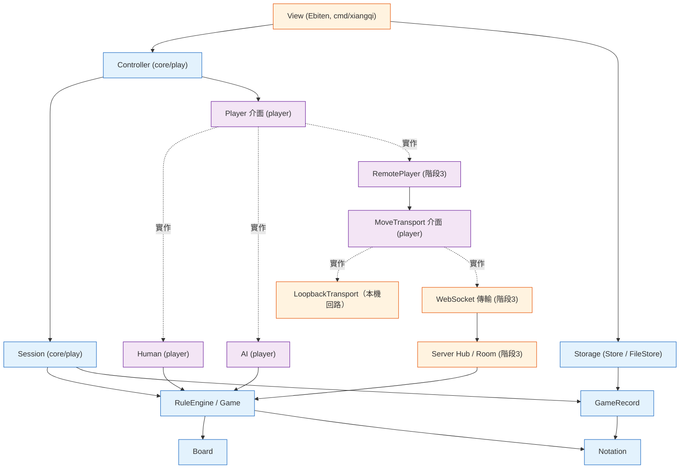
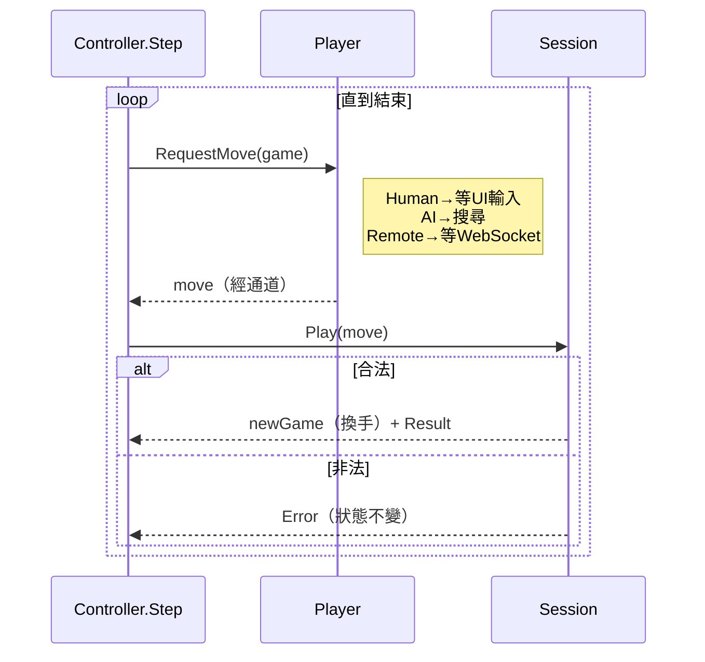

# 中國象棋平台 — 設計文件（索引）

設計原則：**核心邏輯純化、契約語言中立**——平台元件（Ebiten UI、WebSocket）只透過介面與核心溝通，日後以其他語言重寫核心時，只要遵守同一份契約即可無痛轉換。

## 元件總覽

| 層 | 元件 | 套件路徑 | 可移植性 |
|---|---|---|---|
| 核心 | `Board` / `RuleEngine` | `core/board`, `core/rules` | 完全可移植 |
| 核心 | `Notation` / `GameRecord` | `core/notation`, `core/record` | 完全可移植 |
| 核心 | `Storage`（`Store` 介面） | `core/storage` | 介面契約（`FileStore` 為平台實作） |
| 核心 | `Session` / `Controller`（對局狀態與統一迴圈） | `core/play` | 完全可移植（純邏輯） |
| 抽象 | `Player`/`Interactive` 介面 + `Human` / `AI` | `player` | 取步者：介面與實作同處（階段 2） |
| 抽象 | `MoveTransport` 接縫 + `RemotePlayer` + `LoopbackTransport`（本機回路） | `player` | 傳輸中立；回路供本機測試（階段 3 接縫） |
| 平台 | `View`（Ebiten） | `cmd/xiangqi` | 平台相關（`//go:build ebiten`） |
| 平台 | WebSocket 傳輸 / `Hub` | `server` | 協定契約（階段 3，正式線上） |

> 依賴方向：`core/play`（Session/Controller）單向依賴 `player`（取步者抽象與實作）；`player` 不依賴 `core/play`，無 import cycle。「player」一詞統一指 `player` 套件。

## 目錄（細部設計）

| 文件 | 範圍 | 階段 |
|---|---|---|
| [design/rule-engine.md](design/rule-engine.md) | 盤面、走法產生、合法性、勝負判定（最複雜核心） | 1 |
| [design/notation-and-record.md](design/notation-and-record.md) | FEN/UCCI/中文記譜轉換、棋譜記錄與復盤、本機儲存 | 1 |
| [design/player-and-ai.md](design/player-and-ai.md) | 取步者抽象（Player/Interactive）、Human、AI 引擎 | 1–2 |
| [design/client.md](design/client.md) | 單機對局（Session/Controller、Ebiten 渲染、選邊） | 1 |
| [design/online-play.md](design/online-play.md) | 線上對戰：WebSocket 協定、配對、斷線重連 | 3 |
| [design/contracts.md](design/contracts.md) | 跨語言移植契約（座標/FEN/UCCI/棋譜/協定/介面） | 參考 |

> 拆分原則：當單一文件的職責過大時才拆出。基礎且關係緊密的元件就近合併，不過度切割：`Board` 隨 RuleEngine、`Storage` 隨 GameRecord（持久化棋譜，故併入 notation-and-record.md）。

## 核心：通用對局迴圈

單機、AI、線上共用同一套迴圈，差別只在 `Player` 實作（見 [player-and-ai.md](design/player-and-ai.md)）。

