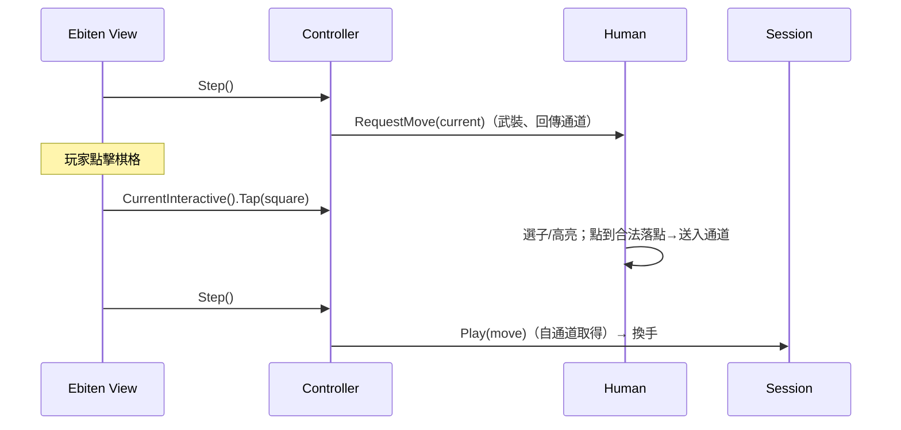

# 設計：單機對局（Session / Controller + Ebiten 渲染）

> 對局機制在 `core/play`（純邏輯、可單元測試）：`Session`（權威狀態）+ `Controller`（統一迴圈）。
> 取步者抽象與實作在 `player`（`Player`/`Interactive` + `Human`/`AI`，見 [player-and-ai.md](player-and-ai.md)）。
> Ebiten 渲染層（`cmd/xiangqi`）以建構標籤 `//go:build ebiten` 隔離，不進入無頭 CI。
> 本機棋譜持久化見 [notation-and-record.md](notation-and-record.md) 的 `Storage`。

## `Session`（對局權威狀態，`core/play`）

**職責**（收斂為純對局狀態，不含 UI 選取）
- 持有走子歷史與當前盤面，`Play(move)` 套用合法走法並記譜。
- 悔棋（`Undo`）、認輸（`Resign`，當前方認輸、對方勝）、依 rule-engine 判定結束（`Outcome`）。
- 隨時輸出 `xiangqi-record-v1` 棋譜（`Record`），交由 `Storage` 持久化。

**對外介面**
```
NewSession(red, black) -> Session
Play(move) -> error        Undo() -> bool        Resign()
Current() -> Game   Turn() -> Color   Outcome() -> Result   Record() -> Record
```
> 點選互動（選子／高亮／改選／取消）不在 Session，而在 `player.Human`（見 [player-and-ai.md](player-and-ai.md)）。

## `Controller`（統一對局迴圈，`core/play`）

**職責**
- 持有 `Session` 與各方 `player.Player`（人類/AI/遠端），以 `Step` 統一推進：向當前 Player 請求一步、完成即 `Session.Play`，不分對手種類。
- `CurrentInteractive` 回傳當前互動式玩家（人類）供 UI 餵入點擊與讀取高亮；`Thinking` 回報是否等待 AI；`Undo`/`Resign` 為對局層級動作（並重置進行中的取步）。
- `VsComputer(red, black, humanColor, ai)`：建立人機對局，可指定人類執方。

### 循序圖：統一迴圈一步（人類回合）


## Ebiten 渲染層（`cmd/xiangqi`）

**職責**
- 繪製棋盤格線、九宮對角、棋子（嵌入 CJK 字型，以 `text/v2` 顯示帥/將…中文字）、選取高亮與合法落點提示。
- 每幀呼叫 `Controller.Step`；人類回合把滑鼠點擊轉成棋格交給 `CurrentInteractive().Tap`。
- **自由選邊**：鍵 `1` 執紅、`2` 執黑；人類執黑時棋盤 180° 翻轉，使己方永遠在下方。其餘鍵：`N` 同陣營新局、`U` 悔棋、`R` 認輸、`S` 匯出棋譜。
- 不含任何規則邏輯——僅渲染當前狀態並轉發輸入。

**建構與執行**
```
pants run cmd/xiangqi:build   # 編譯到 ./bin/xiangqi
pants run cmd/xiangqi:gui     # 直接執行（需圖形環境）
go run -tags ebiten ./cmd/xiangqi
```
以 `//go:build ebiten` 標籤隔離圖形相依；Pants Go 後端不支援自訂 build tag，故以 shell 目標包一層原生 `go` 指令。
