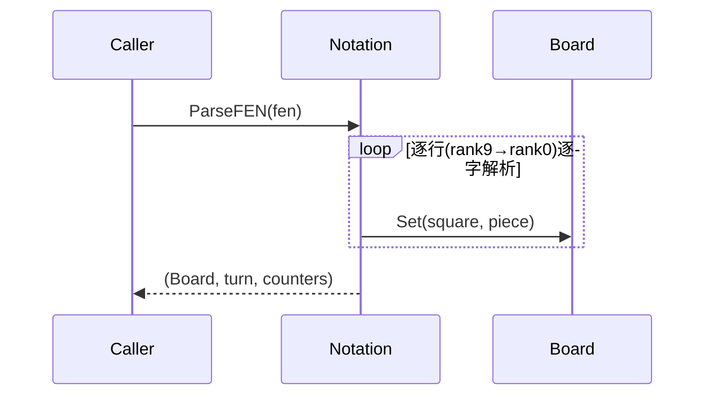
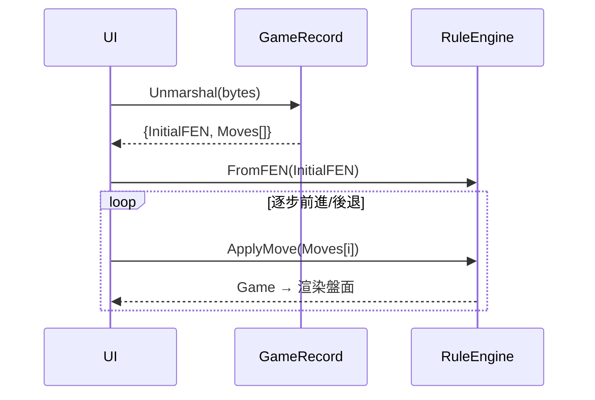
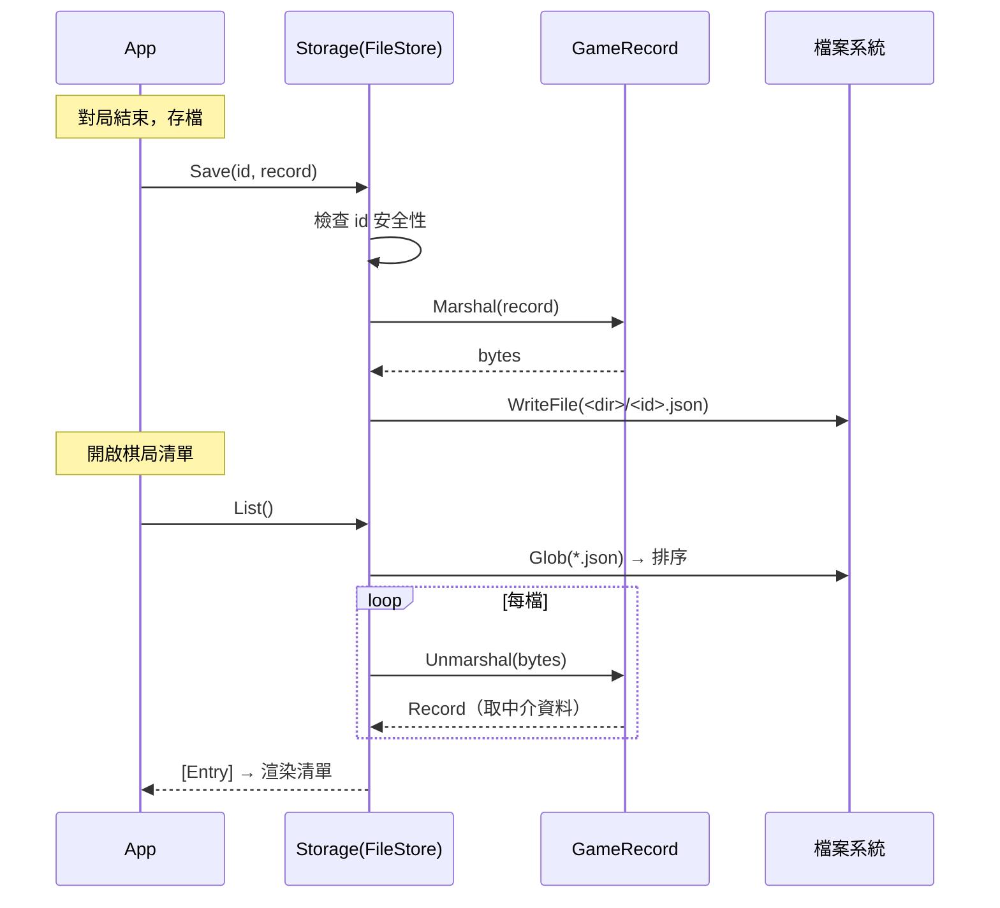

# 設計：記譜、棋譜與儲存（Notation + GameRecord + Storage）

> 核心、完全可移植。記譜轉換、棋譜記錄/復盤、本機持久化。

## `Notation`（記譜轉換）

**職責**
- **FEN ↔ 盤面**：解析與輸出 Xiangqi FEN（大寫紅/小寫黑 + side-to-move + 計步欄位）。
- **UCCI ↔ Move**：座標走法字串與 `Move` 互轉（座標解析在 `board`，組裝在此）。
- **中文記譜法**：將座標走法轉成「炮二平五」等人類可讀字串（顯示層）。
- 儲存一律用 UCCI（機器標準），中文僅即時轉換供顯示。

**對外介面**
```
ParseFEN(fen)                    -> (Board, Color, counters) | Error
EncodeFEN(board, turn, counters) -> fen
ToChinese(board, move, turn)     -> string
```

**協作**：依賴 `Board`；被 `RuleEngine`、`GameRecord` 使用。FEN/UCCI 格式定義見 [contracts.md](contracts.md)。

### 循序圖：FEN 載入與盤面還原


## `GameRecord`（棋譜記錄與復盤）

**職責**
- 以語言中立容器 `xiangqi-record-v1`（JSON）記錄一局：對局者、日期、結果、起始 FEN、UCCI 走法序列。
- 序列化/反序列化棋譜。
- 復盤迭代：由起始 FEN 起逐步套用走法，產生每一手後的盤面。
- 對局中漸進記錄（`Recorder`，逐手以規則引擎驗證合法性）與復盤導覽（`Timeline`）、中文記譜清單。

**對外介面**
```
Record{ Format, Red, Black, Date, Result, InitialFEN, Moves[] }
Marshal(record)   -> bytes
Unmarshal(bytes)  -> Record | Error
Replay(record)    -> [Game]          // 每一手後的盤面序列

Recorder: NewRecorder/NewStartRecorder, Add(uci)[驗證合法], SetResult, Current, Record
Timeline: NewTimeline(record), Len(=走法數+1), At(ply)
MovesInChinese(record) -> [string]   // 走法序列 → 中文清單（顯示用）
```

**協作**：依賴 `RuleEngine`（重放與合法性驗證）與 `Notation`（顯示）；由 `Storage` 持久化。容器格式見 [contracts.md](contracts.md)。

### 循序圖：棋譜復盤回放


## `Storage`（本機棋譜持久化）

**職責**
- 以 `Store` 介面定義語言中立持久化契約：存檔、載入、列表、刪除。
- `FileStore`：以單一目錄為後端的桌面/單機實作，每局棋譜存為一個 `xiangqi-record-v1` JSON 檔（`<dir>/<id>.json`）。
- `List` 回傳輕量 `Entry`（對局者/日期/結果），供棋局清單免載入完整走法即可顯示。
- 識別字安全性：拒絕含路徑分隔或 `..` 的 `id`，避免目錄穿越。

**對外介面**
```
Store(介面):
  Save(id, record) -> Error
  Load(id)         -> Record | Error      // 未知 id 回報不存在
  List()           -> [Entry] | Error      // 依 id 升冪排序
  Delete(id)       -> Error
Entry{ ID, Red, Black, Date, Result }
FileStore: NewFileStore(dir) -> Store
```

**協作**：依賴 `GameRecord`（`Marshal`/`Unmarshal`）。`Store` 為介面契約（可移植），`FileStore` 為平台實作——行動端可另實作平台儲存。`record` 套件維持純邏輯，os 相依集中於 `core/storage`。

### 循序圖：存檔與棋局清單

