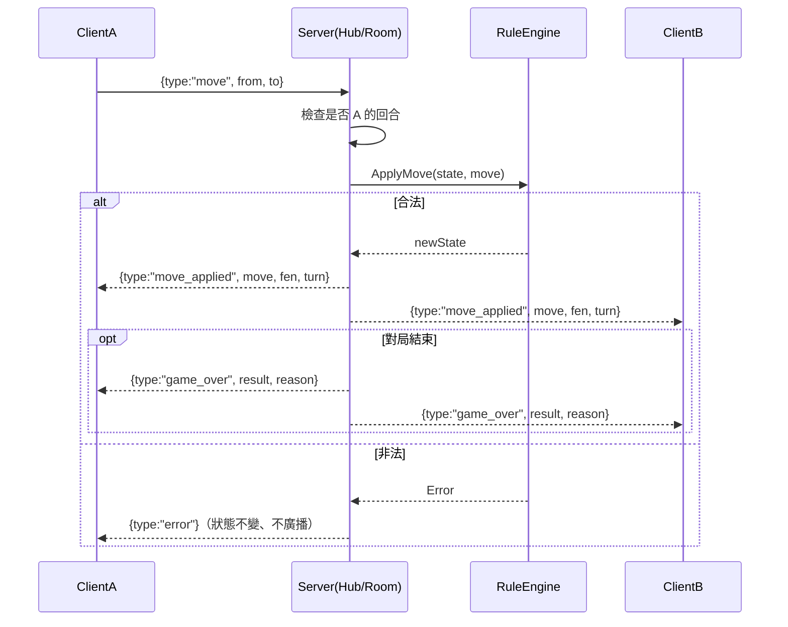
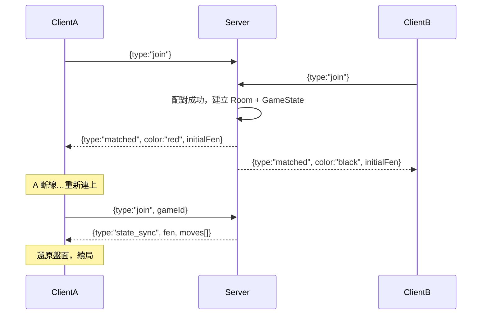

# 設計：線上對戰（Transport + Server Hub）

> 平台層、協定契約。**階段 3，暫緩**。象棋為回合制，採 WebSocket + 權威伺服器。
> 選型理由（vs WebRTC）見專案規劃；協定欄位定義見 [contracts.md](contracts.md)。

## 傳輸分層（傳輸中立接縫）

對局核心只依賴 `player.MoveTransport`（`Incoming() <-chan board.Move` / `Send(board.Move) error`）；
`player.RemotePlayer` 以此為走法來源，將遠端對手納入統一對局迴圈。更換傳輸實作 **不需改動核心**。

| 層 | 角色 | 用途 | 狀態 |
|---|---|---|---|
| L0 `MoveTransport` 介面 | 傳輸中立接縫 | 核心唯一依賴 | ✅ 已具備 |
| L1 `LoopbackTransport`（記憶體內） | 兩端點以通道對接、零網路、決定性 | 本機測試、CI、本機對打 | ✅ 已具備 |
| L2 WebSocket 傳輸 + Server Hub | 真正即時通道＋權威伺服器 | 正式線上、端對端測試 | ✅ 已實作（`server`／`client`，見下「實作對應」） |

- **「local 方便測試」的便利性來自 L0 介面，而非 WebSocket**：L1 `LoopbackTransport` 在單一行程內以
  `NewLoopbackPair()` 把紅、黑兩端串成一局，不需架站、不碰網路、可重現，適合單元/整合測試與本機對打。
- **正式線上採 WebSocket 由目標平台決定**：須同時支援 **Android、WASM（Ebiten web export → LINE LIFF 網頁）**，
  WebSocket 是三者皆可用的雙向即時通道（回合制象棋已足夠，選型 vs WebRTC 見上）。它只是 `MoveTransport`
  的另一個實作，與 L1 可互換。
  > 函式庫（L2 已定案）：採 **`github.com/coder/websocket`**（前 `nhooyr.io/websocket`），可編入 WASM
  > 以支援 WASM/LIFF；`gorilla/websocket` 無法編入 WASM，故不採用。
- L1 無權威伺服器、僅轉送走法；合法性仍由各端 `Session`/`RuleEngine` 把關。權威驗證於 L2（Server Hub）才引入。

## 元件職責

- `Transport`（客戶端）：WebSocket 連線，編解碼 JSON envelope；作為 `RemotePlayer` 的走法來源。
- `Server Hub / Room`：配對、房間管理、**權威驗證**（重用 `RuleEngine` 驗證每一步）、廣播、斷線重連。

## 實作對應（L2）

| 概念 | 套件 / 型別 | 說明 |
|---|---|---|
| 協定 envelope | `server.Envelope`／`Encode`／`Decode`／`DecodePayload` | `{ type, gameId, payload }` JSON 編解碼；未知型別/損壞 JSON 回報錯誤 |
| 訊息型別 | `server.MsgType`（`TypeJoin`/`TypeMove`/`TypeResign`／`TypeMatched`/`TypeMoveApplied`/`TypeGameOver`/`TypeError`/`TypeStateSync`） | 對齊本檔「協定」段落與 `contracts.md §4` |
| 權威房間 | `server.Room`（`HandleMove`） | 回合檢查 → `core/rules` 驗證套用 → 向雙方廣播（對應「線上走子」循序圖） |
| 配對/路由/重連 | `server.Hub`（`Handle`／`Disconnect`／`Handler`） | join 配對、依 gameId 路由 move、`gameId` 重連回 `state_sync`（對應「配對與斷線重連」循序圖） |
| WS 升級端點 | `server.Hub.Handler()`（`net/http`） | 升級連線、逐則讀取交 `Hub.Handle`、斷線通知 `Hub.Disconnect` |
| 客戶端傳輸 | `client.WSTransport`（`Dial`／`Incoming`／`Send`／`WaitMatched`／`Close`） | 實作 `player.MoveTransport`，與 L1 `LoopbackTransport` 互換；採 `coder/websocket`（可編入 WASM） |

> 測試：`server` 套件以測試替身（`Conn`）直接驗證 Room/Hub 邏輯（傳輸無關、決定性）；
> `client` 套件以 `httptest` 起 localhost WS server 做行程內端對端收發。皆通過 `-race`。

## 協定（JSON envelope `{ type, gameId, payload }`）

- client→server：`join` / `move` / `resign` / `draw_offer` / `draw_accept` / `takeback_request` / `chat`
- server→client：`matched` / `move_applied` / `game_over` / `error` / `opponent_left` / `state_sync`

## 循序圖：線上走子（權威伺服器）

## 循序圖：配對與斷線重連

