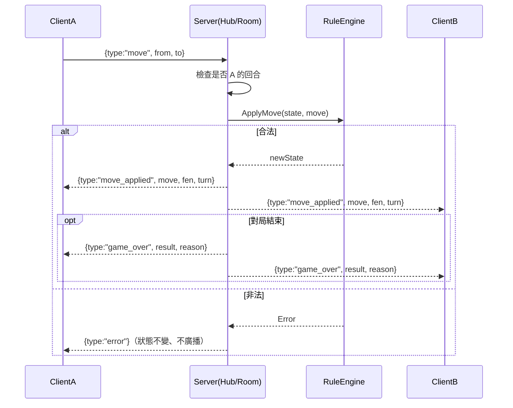
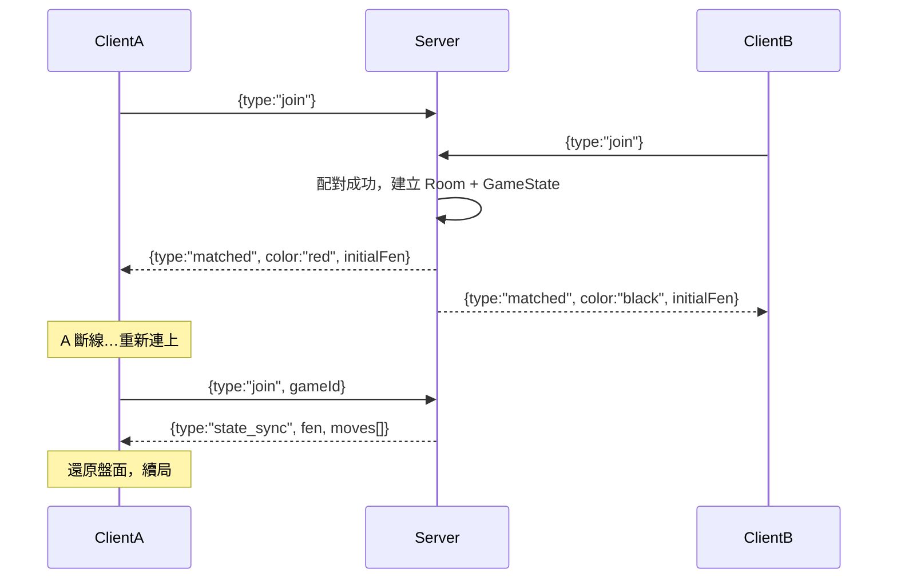

# 設計：線上對戰（Transport + Server Hub）

> 平台層、協定契約。**階段 3，暫緩**。象棋為回合制，採 WebSocket + 權威伺服器。
> 選型理由（vs WebRTC）見專案規劃；協定欄位定義見 [contracts.md](contracts.md)。

## 元件職責

- `Transport`（客戶端）：WebSocket 連線，編解碼 JSON envelope；作為 `RemotePlayer` 的走法來源。
- `Server Hub / Room`：配對、房間管理、**權威驗證**（重用 `RuleEngine` 驗證每一步）、廣播、斷線重連。

## 協定（JSON envelope `{ type, gameId, payload }`）

- client→server：`join` / `move` / `resign` / `draw_offer` / `draw_accept` / `takeback_request` / `chat`
- server→client：`matched` / `move_applied` / `game_over` / `error` / `opponent_left` / `state_sync`

## 循序圖：線上走子（權威伺服器）

## 循序圖：配對與斷線重連

