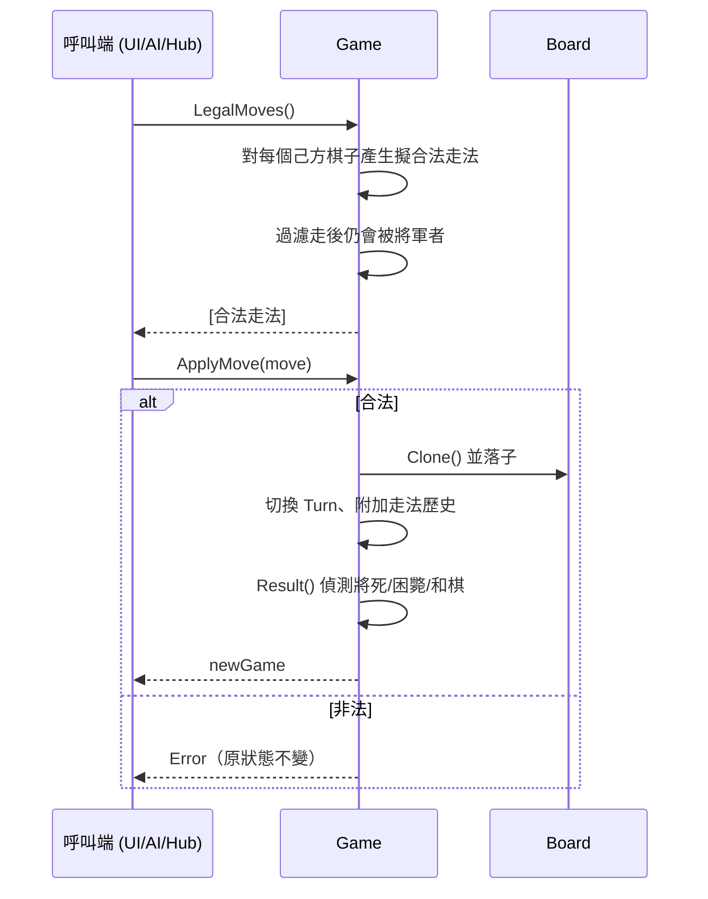

# 設計：規則引擎（Board + RuleEngine）

> 核心、最複雜、完全可移植。承載象棋規則的權威行為。
> 規格見 `openspec/changes/add-rule-engine/specs/rule-engine/spec.md`。

## `Board`（盤面基礎）

**職責**
- 定義座標系（file a–i / rank 0–9）、棋子表示（FEN 字母）、顏色。
- 提供盤面格子的讀寫與深拷貝。
- **不含任何規則邏輯**（不知道馬怎麼走）。

**對外介面**
```
MakeSquare(file, rank) -> Square
Square.File() / Rank() / Valid() / String()
ParseSquare("e0") -> Square
ParseUCCI("h2e2") -> Move
Board.Get/Set(sq) / Clone()
Piece.IsEmpty() / Color() / Kind()
```

**棋子表示與 `Piece.Kind()` 對應**

`Piece` 以 FEN 字母（byte）表示：大寫=紅、小寫=黑、`Empty`=空格。
`Piece.Color()` 由大小寫判定顏色；`Piece.Kind()` 一律回傳**小寫字母**作為種類（紅黑同種同 kind），供走法產生分派。

| Kind | 棋子 | 紅 (大寫) | 黑 (小寫) |
|:---:|---|:---:|:---:|
| `k` | 帥／將 | `K` | `k` |
| `a` | 仕／士 | `A` | `a` |
| `b` | 相／象 | `B` | `b` |
| `n` | 馬 | `N` | `n` |
| `r` | 車 | `R` | `r` |
| `c` | 炮 | `C` | `c` |
| `p` | 兵／卒 | `P` | `p` |

> 例：`Piece('N').Kind() == 'n'`、`Piece('n').Kind() == 'n'`；走法產生（`movegen.go`）即依此 kind 分派各子規則。

**協作**：被 `Notation`、`RuleEngine` 使用；自身不依賴其他元件。

## `RuleEngine` / `Game`

**職責**
- 持有一局的權威狀態：盤面 + 輪誰走 + 走法歷史 + 結果。
- 產生合法走法、判斷合法性（蹩馬腿、塞象眼、炮架吃子、過河兵、仕相不出宮/不過河、將帥不照面、將軍時必須應將）。
- 判定結果：將死、困斃（無合法走法判負）、長將判負、和棋。
- `ApplyMove` 採**不可變**語意：回傳新的 `Game`（利於復盤與 AI 搜尋）。

**對外介面契約**（語言中立 pseudo-IDL）
```
NewGame()                -> Game
FromFEN(fen)             -> Game | Error
Game.ToFEN()             -> fen
Game.Turn()              -> Color
Game.LegalMoves()        -> [Move]
Game.IsLegal(move)       -> bool
Game.ApplyMove(move)     -> Game | Error      // 不可變：回傳新狀態
Game.Result()            -> { Over, Winner, Reason }
Game.ToChinese(move)     -> string            // 顯示用中文記譜
```
`Result.Reason` ∈ `{ checkmate, stalemate, perpetual_check, agreement, ... }`。

**協作**：依賴 `Board` 與 `Notation`；被 `GameLoop`、`AIEngine`、`Server Hub` 使用。

**走法產生策略**：先產生「擬合法」走法（僅看走子規則與蹩馬腿/塞象眼/炮架），再過濾「走後自將/飛將」。將死/困斃統一以「無合法走法」判定，再依是否被將軍區分結果。

## 循序圖：產生並套用一步合法走法


